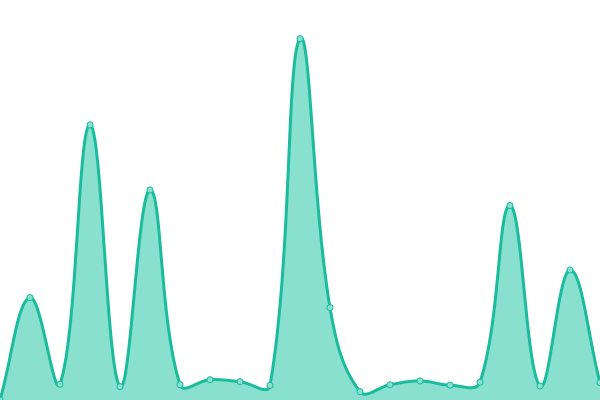
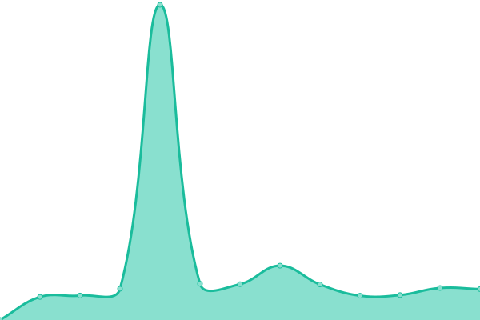
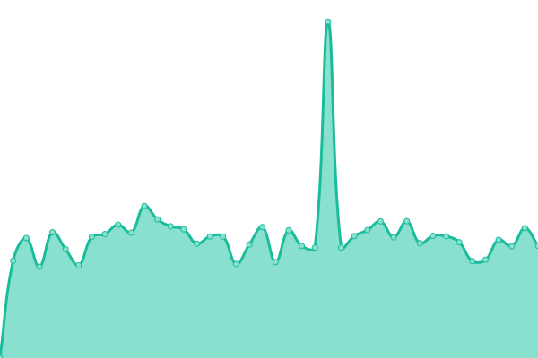
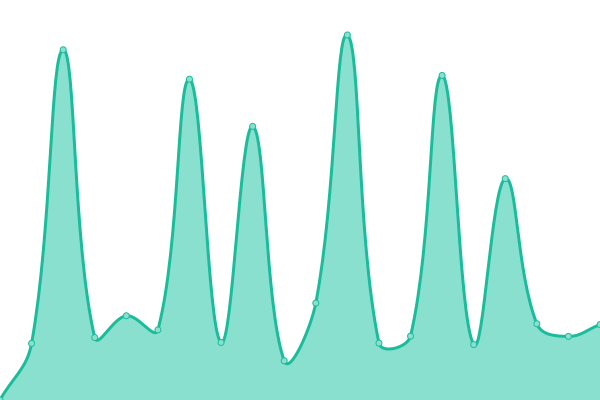
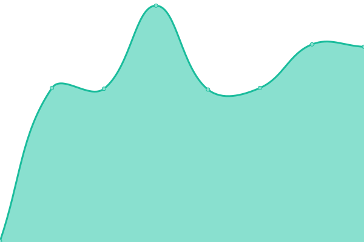

# [📈 Live Status](https://demo.upptime.js.org): <!--live status--> **🟧 Partial outage**

This repository contains the open-source uptime monitor and status page for [omarifs](https://demo.upptime.js.org), powered by [Upptime](https://github.com/upptime/upptime).

With [Upptime](https://upptime.js.org), you can get your own unlimited and free uptime monitor and status page, powered entirely by a GitHub repository. We use [Issues](https://github.com/omarifs/uptime-monitoring/issues) as incident reports, [Actions](https://github.com/omarifs/uptime-monitoring/actions) as uptime monitors, and [Pages](https://demo.upptime.js.org) for the status page.

<!--start: status pages-->
<!-- This summary is generated by Upptime (https://github.com/upptime/upptime) -->
<!-- Do not edit this manually, your changes will be overwritten -->
<!-- prettier-ignore -->
| URL | Status | History | Response Time | Uptime |
| --- | ------ | ------- | ------------- | ------ |
|  [Agrowisata Amanah](https://agrowisataamanah.id) | 🟩 Up | [agrowisata-amanah.yml](https://github.com/omarifs/uptime-monitoring/commits/HEAD/history/agrowisata-amanah.yml) | 

 1093ms
     
 | 

<a href="https://uptime.websolusi.com/history/agrowisata-amanah">100.00%</a>
    

|  [Berkah Multi](https://berkahmulti.com) | 🟩 Up | [berkah-multi.yml](https://github.com/omarifs/uptime-monitoring/commits/HEAD/history/berkah-multi.yml) | 

 4710ms
     
 | 

<a href="https://uptime.websolusi.com/history/berkah-multi">4.82%</a>
    

|  [AdGuard Domainesia](https://dns.tsdn.my.id) | 🟩 Up | [ad-guard-domainesia.yml](https://github.com/omarifs/uptime-monitoring/commits/HEAD/history/ad-guard-domainesia.yml) | 

 3269ms
     
 | 

<a href="https://uptime.websolusi.com/history/ad-guard-domainesia">23.35%</a>
    

|  [AdGuard Websolusi](https://dns.websolusi.com) | 🟩 Up | [ad-guard-websolusi.yml](https://github.com/omarifs/uptime-monitoring/commits/HEAD/history/ad-guard-websolusi.yml) | 

 2402ms
     
 | 

<a href="https://uptime.websolusi.com/history/ad-guard-websolusi">100.00%</a>
    

|  [Flask Websolusi](https://flask.websolusi.com) | 🟩 Up | [flask-websolusi.yml](https://github.com/omarifs/uptime-monitoring/commits/HEAD/history/flask-websolusi.yml) | 

 834ms
     
 | 

<a href="https://uptime.websolusi.com/history/flask-websolusi">92.79%</a>
    

|  [Whatsapp gateway](https://wa.websolusi.com/session?key=28074e6b-6456-4730-8ffd-6915876352d5&session=notif) | 🟩 Up | [whatsapp-gateway.yml](https://github.com/omarifs/uptime-monitoring/commits/HEAD/history/whatsapp-gateway.yml) | 

 681ms
     
 | 

<a href="https://uptime.websolusi.com/history/whatsapp-gateway">93.04%</a>
    

|  [Gama Aims Backend](https://gamaaims.com) | 🟥 Down | [gama-aims-backend.yml](https://github.com/omarifs/uptime-monitoring/commits/HEAD/history/gama-aims-backend.yml) | 

 3486ms
     
 | 

<a href="https://uptime.websolusi.com/history/gama-aims-backend">13.83%</a>
    

|  [Jaya Samudra Agency](https://jayasamudra-agency.com) | 🟩 Up | [jaya-samudra-agency.yml](https://github.com/omarifs/uptime-monitoring/commits/HEAD/history/jaya-samudra-agency.yml) | 

 564ms
     
 | 

<a href="https://uptime.websolusi.com/history/jaya-samudra-agency">100.00%</a>
    

|  [KB TK Taman Bahagia](https://kbtktamanbahagia.sch.id) | 🟩 Up | [kb-tk-taman-bahagia.yml](https://github.com/omarifs/uptime-monitoring/commits/HEAD/history/kb-tk-taman-bahagia.yml) | 

 1231ms
     
 | 

<a href="https://uptime.websolusi.com/history/kb-tk-taman-bahagia">95.56%</a>
    

|  [Tools Domainesia](https://tools.tsdn.my.id) | 🟩 Up | [tools-domainesia.yml](https://github.com/omarifs/uptime-monitoring/commits/HEAD/history/tools-domainesia.yml) | 

 3356ms
     
 | 

<a href="https://uptime.websolusi.com/history/tools-domainesia">100.00%</a>
    

|  [Tools Websolusi](https://tools.websolusi.com/belajar/) | 🟩 Up | [tools-websolusi.yml](https://github.com/omarifs/uptime-monitoring/commits/HEAD/history/tools-websolusi.yml) | 

 2932ms
     
 | 

<a href="https://uptime.websolusi.com/history/tools-websolusi">100.00%</a>
    

|  [Websolusi](https://websolusi.com) | 🟩 Up | [websolusi.yml](https://github.com/omarifs/uptime-monitoring/commits/HEAD/history/websolusi.yml) | 

 645ms
     
 | 

<a href="https://uptime.websolusi.com/history/websolusi">94.60%</a>
    

|  [Monit Server (Lessie)](https://live.websolusi.com) | 🟩 Up | [monit-server-lessie.yml](https://github.com/omarifs/uptime-monitoring/commits/HEAD/history/monit-server-lessie.yml) | 

 722ms
     
 | 

<a href="https://uptime.websolusi.com/history/monit-server-lessie">95.31%</a>
    

|  [VPS Arif](103.161.184.136) | 🟩 Up | [vps-arif.yml](https://github.com/omarifs/uptime-monitoring/commits/HEAD/history/vps-arif.yml) | 

 206ms
     
 | 

<a href="https://uptime.websolusi.com/history/vps-arif">100.00%</a>
    

|  [Resolver (17.82)](103.123.17.82) | 🟩 Up | [resolver-17-82.yml](https://github.com/omarifs/uptime-monitoring/commits/HEAD/history/resolver-17-82.yml) | 

 213ms
     
 | 

<a href="https://uptime.websolusi.com/history/resolver-17-82">100.00%</a>
    

|  [VPN 16-118](103.123.16.118) | 🟩 Up | [vpn-16-118.yml](https://github.com/omarifs/uptime-monitoring/commits/HEAD/history/vpn-16-118.yml) | 

 222ms
     
 | 

<a href="https://uptime.websolusi.com/history/vpn-16-118">100.00%</a>
    

<!--end: status pages-->

[**Visit our status website →**](https://demo.upptime.js.org)

## 📄 License

- Powered by: [Upptime](https://github.com/upptime/upptime)
- Code: [MIT](./LICENSE) © [Anand Chowdhary](https://anandchowdhary.com), supported by [Pabio](https://pabio.com)
- Data in the `./history` directory: [Open Database License](https://opendatacommons.org/licenses/odbl/1-0/)
